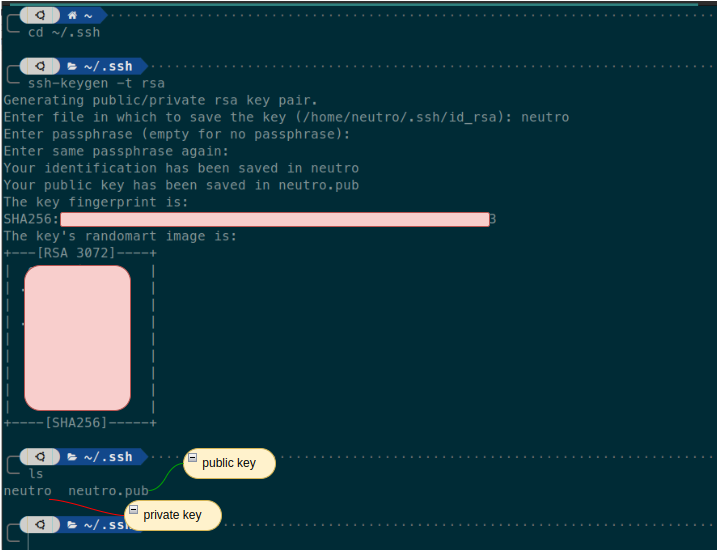

# Steps
1. cd ~/.ssh
2. Run 
    ```bash
    ssh-keygen -t rsa
    ```

    Fill the name (in this example) <code>neutro</code>. Then just enter the remain.

3. The ssh key should be generated private and public



4. Add ssh public key to github
    ``` bash
    cat neutro.pub
    ```

    copy all the content (from begining till the end)

5. Open Github portal, Setting > SSH and GPG Keys > click <code>New SSH Key</code> button. Fill the title, key type as <code>Authentication Key</code>. Then paste the copied of ssh public key on step 4. Finally click <code>Add SSH Key</code> button.

6. Add ssh identity
    ``` bash
    ssh-add neutro
    ```

7. Create file <code>~/.ssh/config</code>. Fill it with
    ``` bash
    # SSH identity for github.com
    Host github.com
    IdentityFile ~/.ssh/neutro
    ```

8. Clone git repo through ssh, the do changes and commit-push to github.

# Reference
1. https://www.theserverside.com/blog/Coffee-Talk-Java-News-Stories-and-Opinions/GitHub-SSH-Key-Setup-Config-Ubuntu-Linux

